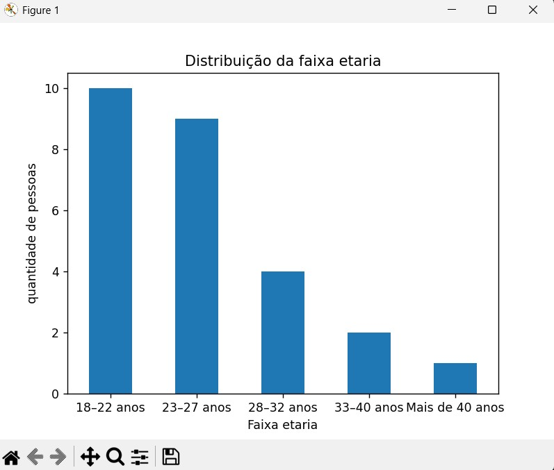
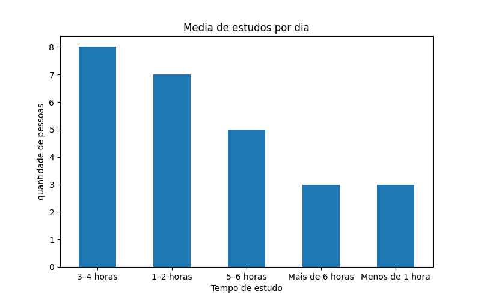
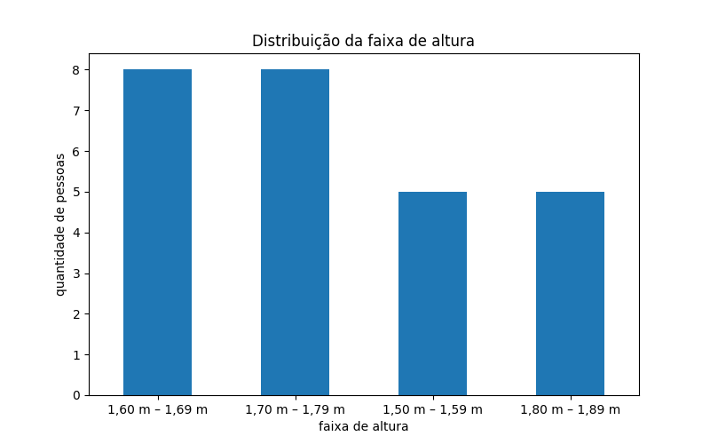

# 📊 Projeto 01 — Pesquisa Estatística Simples

## 📌 Sobre o Projeto

Este projeto foi desenvolvido como parte dos estudos introdutórios do módulo de Fundamentos da Estatística, com o objetivo de aplicar conceitos estatísticos básicos em um contexto prático de análise de dados.

A proposta do projeto consiste na criação de uma pesquisa estatística simples utilizando Google Forms, seguida pelas etapas de coleta, tratamento, análise e visualização dos dados utilizando Python.

Durante o desenvolvimento, foram aplicados conceitos fundamentais de estatística descritiva, como:

- população e amostra
- variáveis categóricas
- frequência absoluta
- frequência relativa
- porcentagens
- distribuição de dados

Além da parte estatística, o projeto também foi estruturado utilizando práticas profissionais de versionamento com Git e GitHub.

## 🎯 Objetivo

O principal objetivo deste projeto foi aplicar, na prática, os fundamentos iniciais da estatística descritiva por meio da construção de uma pesquisa simples e da análise dos dados coletados.

O projeto buscou desenvolver habilidades relacionadas a:

- coleta de dados
- organização de datasets
- limpeza e tratamento de dados
- análise estatística descritiva
- visualização de dados
- documentação técnica de projetos

## 📊 Variáveis Analisadas

As variáveis coletadas durante a pesquisa foram:

| Variável | Descrição | Tipo |
|---|---|---|
| faixa_etaria | Faixa de idade dos participantes | Qualitativa Ordinal |
| faixa_altura | Faixa de altura dos participantes | Qualitativa Ordinal |
| curso | Curso dos participantes | Qualitativa Nominal |
| media_estudos | Média diária de estudos | Qualitativa Ordinal |

### 📌 Classificação Estatística

- **Qualitativa Nominal:** categorias sem ordem natural.
- **Qualitativa Ordinal:** categorias que possuem uma ordem lógica entre si.

## 🛠 Tecnologias Utilizadas

As principais tecnologias e ferramentas utilizadas no desenvolvimento do projeto foram:

- **Python** — linguagem principal utilizada na análise de dados
- **Pandas** — manipulação e tratamento dos dados
- **Matplotlib** — criação de gráficos estatísticos
- **Google Forms** — coleta dos dados da pesquisa
- **Git** — versionamento do projeto
- **GitHub** — hospedagem e gerenciamento do repositório
- **VSCode** — ambiente de desenvolvimento utilizado

## 📂 Estrutura do Projeto

```bash
estatistica-projeto-01-pesquisa-simples/
│
├── assets/
│   └── graphs/                 # gráficos gerados na análise
│
├── data/
│   ├── raw/                    # dados brutos coletados
│   └── processed/              # dados tratados e limpos
│
├── docs/                       # documentação complementar
│
├── notebooks/                  # estudos e anotações futuras
│
├── src/
│   ├── limpeza_dados.py        # tratamento e limpeza dos dados
│   ├── analise_estatistica.py  # análise estatística descritiva
│   └── visualizacao_dados.py   # geração dos gráficos
│
├── README.md
├── requirements.txt
└── .gitignore
```

## 📈 Etapas do Projeto

O projeto foi desenvolvido seguindo um pipeline básico de análise de dados:

### 1️⃣ Planejamento Estatístico
- definição das variáveis
- estruturação da pesquisa
- classificação dos tipos de dados

### 2️⃣ Coleta de Dados
- criação do formulário no Google Forms
- obtenção das respostas dos participantes
- exportação dos dados em formato CSV

### 3️⃣ Limpeza e Tratamento dos Dados
- leitura dos dados utilizando Pandas
- padronização das colunas
- remoção de informações desnecessárias
- validação dos dados coletados

### 4️⃣ Análise Estatística Descritiva
- frequência absoluta
- frequência relativa
- cálculo de porcentagens
- organização em tabelas estatísticas

### 5️⃣ Visualização de Dados
- criação de gráficos estatísticos
- análise visual das distribuições
- exportação das visualizações

## 📊 Análise Estatística

Durante a análise estatística descritiva dos dados coletados, foram calculadas:

- frequência absoluta
- frequência relativa
- porcentagens
- distribuições das variáveis

### 📌 Principais Resultados

- A faixa etária mais frequente foi **18–22 anos**, representando aproximadamente **38,46%** da amostra.
- O curso com maior número de participantes foi **ADS**, representando cerca de **23,08%** dos respondentes.
- A média de estudos predominante foi de **3–4 horas por dia**.
- As faixas de altura **1,60 m – 1,69 m** e **1,70 m – 1,79 m** apresentaram as maiores frequências na pesquisa.

A análise permitiu compreender a distribuição das variáveis coletadas e aplicar, na prática, os fundamentos iniciais da estatística descritiva.

## 📉 Visualização de Dados

### 📊 Distribuição da Faixa Etária



---

### 📚 Distribuição dos Cursos


---

### ⏰ Média de Estudos por Dia



---

### 📏 Distribuição das Faixas de Altura




## 🚀 Como Executar o Projeto

### 📌 Clone o repositório

```bash
git clone https://github.com/AgathaAlmeida7/estatistica-projeto-01-pesquisa-simples.git
```

---

### 📌 Acesse a pasta do projeto

```bash
cd estatistica-projeto-01-pesquisa-simples
```

---

### 📌 Crie o ambiente virtual

```bash
python -m venv venv
```

---

### 📌 Ative o ambiente virtual

#### Windows

```bash
venv\Scripts\activate
```

#### Linux/Mac

```bash
source venv/bin/activate
```

---

### 📌 Instale as dependências

```bash
pip install pandas matplotlib
```

---

### 📌 Execute os scripts

#### Limpeza dos dados

```bash
python src/limpeza_dados.py
```

#### Análise estatística

```bash
python src/analise_estatistica.py
```

#### Visualização dos dados

```bash ou terminal do vscode
python src/visualizacao_dados.py
```

## 📚 Aprendizados

Durante o desenvolvimento deste projeto, foi possível aplicar na prática diversos conceitos introdutórios da estatística e da análise de dados.

Os principais aprendizados foram:

- estruturação de uma pesquisa estatística
- diferenciação entre população e amostra
- classificação de variáveis estatísticas
- manipulação de dados com Pandas
- limpeza e tratamento de datasets
- cálculo de frequência absoluta e relativa
- interpretação de porcentagens
- criação de gráficos estatísticos com Matplotlib
- organização profissional de projetos com Git e GitHub
- utilização de branches e versionamento de código

Além dos conceitos estatísticos, o projeto também contribuiu para o desenvolvimento da organização de projetos de análise de dados utilizando uma estrutura semelhante à utilizada em projetos reais.


## 👩‍💻 Autora

Desenvolvido por **Agatha Almeida** durante os estudos do módulo de Fundamentos da Estatística.

🔗 GitHub: https://github.com/AgathaAlmeida7